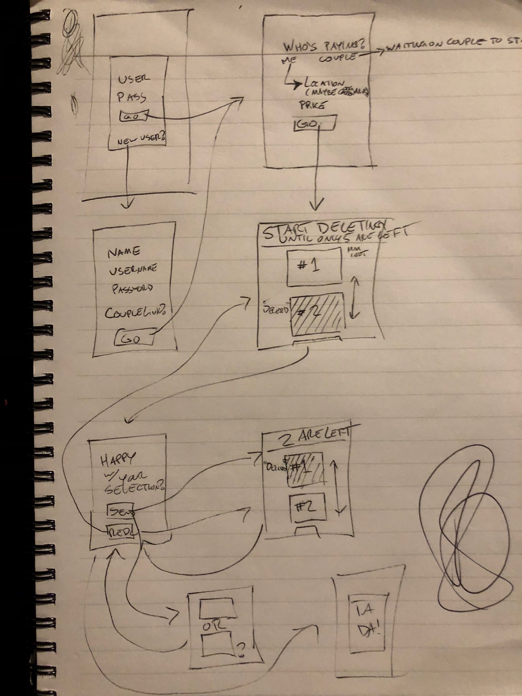

### [Project-2 (Dine 5-2-1)](https://dine5-2-1.herokuapp.com/)

This project will is called Dine 5-2-1.
The purpose of this app will be to assist couples in deciding where to eat.

It utilizes yelp api to load a list of 25 restaurants based on some simple criteria($$$, location), and display them to a user.
That user will reduce that list to 5 restaurants, and then their partner will get the list of 5.
The partner will reduce that list of 5 to 2, then send it to the original user.
The original user will select the restaurant they are going to.

#### Wireframe(s)

[Link to Trello Board](https://trello.com/b/ifEdQEDW/project-2)

#### Technologies Used:
##### Node
-Express
-Passport
-Request
-EJS
-Mongoose

##### MongoDB

##### JavaScript
-JQuery

#####CSS & HTML
-Bootstrap

##### Heroku

#### Approach Taken:
Started with server.js and functioning API call and save to Mongo via restaurant models.
Then, worked on displaying Mongo data to the screen and manipulating it both on back & front ends.
Implemented authentication/authorization via passport and added a Couple model.
Worked on route logic until it was in decent shape.
...Style...

#### Installation Instructions:
No installation should be necessary for users.  Head to the [heroku hosted site](https://dine5-2-1.herokuapp.com/) to use it.

#### Unsolved Problems:
Styling is not pretty, but fully functional.
Some UX data would be helpful in ensuring usability.
A few areas of code are redundant and unnecessary.  Improve logic.

